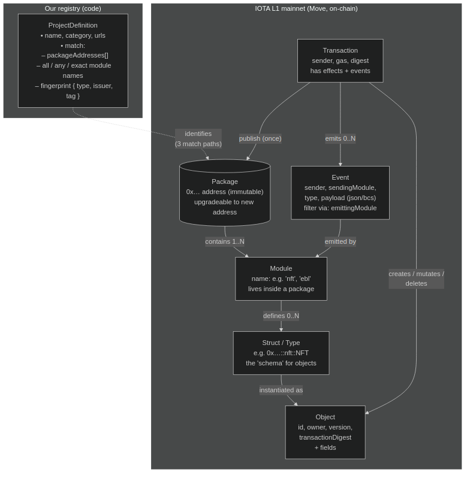

# IOTA Trade Scanner

**🌐 Live dashboard: [iota-trade-scanner.net](https://iota-trade-scanner.net)**

[](https://github.com/r-sw-eet/iota-trade-scanner/actions/workflows/ci.yml)
[](https://codecov.io/gh/r-sw-eet/iota-trade-scanner)

On-chain data analytics dashboard for the IOTA mainnet. Tracks real network activity and monitors 40+ ecosystem projects.

> ⚠️ **Work in progress** — this project is under active development. Data may contain errors and breaking changes can happen at any time. If you're a developer and specifics about your team, project, or dApp are missing, please contact [hello@iota-trade-scanner.net](mailto:hello@iota-trade-scanner.net).

## Features

- **Live mainnet data** — network metrics refreshed every 30 minutes via IOTA RPC/GraphQL
- **Ecosystem scanner** — auto-discovers Move packages across 40+ projects (DeFi, Trade Finance, Identity, NFT, Bridges, Oracles, Games)
- **Event tracking** — real-time on-chain events per project
- **Reality check** — interactive scenario modeling for deflation paths with adjustable TX volume and gas cost multipliers
- **Charts** — supply distribution, inflation vs deflation, historical trends, project activity
- **Storage pricing calculator** — live cost estimates for different object sizes
- **Developer sources** — curl examples for all data sources, full transparency on methods
- **No API keys required** — all data from public IOTA endpoints

## Tech Stack

| Component | Technology                           |
|-----------|--------------------------------------|
| API       | NestJS 11, TypeScript, Mongoose      |
| Database  | MongoDB 7                            |
| Website   | Nuxt 3 (SPA), Tailwind CSS, Chart.js |
| Infra     | Docker Compose, Node.js 22           |

## Architecture

How the scanner maps on-chain Move artefacts to projects it tracks: our registry (`ProjectDefinition`) identifies packages via one of three match paths (`packageAddresses` → module matchers → `fingerprint`), then attributes packages, modules, objects, and events back to projects and teams.



> **New to IOTA / Move?** See [`docs/architecture-simple.mmd`](docs/architecture-simple.mmd) for a non-technical walkthrough (what a package / module / object / event are, in plain English), and [`docs/architecture-process.mmd`](docs/architecture-process.mmd) for a concrete example showing how one NFT sale produces the numbers on the dashboard. The same diagrams are also rendered on the live dashboard under **How it works**.

## Quick Start

```bash
# Start everything (MongoDB + API + Website)
make local

# API:     http://localhost:3004/api/v1/health
# Website: http://localhost:3000
```

## Development

```bash
# Start MongoDB via Docker
docker compose up -d mongodb

# Terminal 1: API in watch mode
make dev-api

# Terminal 2: Nuxt dev server
make dev-web
```

## API Endpoints

All endpoints prefixed with `/api/v1`.

| Endpoint                                       | Description                                                   |
|------------------------------------------------|---------------------------------------------------------------|
| `GET /health`                                  | Health check                                                  |
| `GET /snapshots/latest`                        | Latest epoch snapshot with all network metrics                |
| `GET /snapshots/history?days=30`               | Historical snapshots                                          |
| `GET /snapshots/epochs`                        | Full epoch-level data                                         |
| `GET /ecosystem`                               | Ecosystem overview (all L1/L2 projects, events, storage, TVL) |
| `GET /ecosystem/project/:slug`                 | Single project details                                        |
| `GET /ecosystem/project/:slug/events?limit=20` | Recent on-chain events for a project                          |

## Data Sources

| Source       | URL                                 | Usage                                 |
|--------------|-------------------------------------|---------------------------------------|
| IOTA RPC     | `https://api.mainnet.iota.cafe`     | Network state, packages, transactions |
| IOTA GraphQL | `https://graphql.mainnet.iota.cafe` | Epoch data, events, object queries    |
| DefiLlama    | `https://api.llama.fi/protocols`    | TVL data for L2 projects              |

## Refresh Schedule

| Job              | Interval      | What it does                                                           |
|------------------|---------------|------------------------------------------------------------------------|
| Snapshot capture | Every 30 min  | Fetches latest IOTA network state, stores in DB                        |
| Ecosystem scan   | Every 6 hours | Scans all mainnet packages, counts events, enriches with DefiLlama TVL |
| Epoch backfill   | On startup    | Fills missing epochs from epoch 1 to current                           |

## Project Structure

```
iota-trade-scanner/
├── api/                    # NestJS backend
│   ├── src/
│   │   ├── main.ts         # Bootstrap (port 3004, /api/v1 prefix)
│   │   ├── health/         # Health check
│   │   ├── snapshot/       # Network snapshots (epoch data)
│   │   ├── ecosystem/      # Project discovery & monitoring
│   │   │   └── projects/   # 40+ project definitions (DeFi, Trade, NFT, ...)
│   │   └── iota/           # IOTA RPC/GraphQL client
│   └── Dockerfile
├── website/                # Nuxt 3 frontend (SPA)
│   ├── pages/
│   │   ├── index.vue       # Main dashboard
│   │   └── project/[slug].vue  # Project detail page
│   ├── components/         # MetricCard, EpochCharts, ProjectLogo
│   ├── composables/        # useApi, useIota
│   └── Dockerfile
├── docker-compose.yml
├── Makefile
└── TODO.md
```

## Make Targets

| Target           | Description                                 |
|------------------|---------------------------------------------|
| `make local`     | Full Docker stack (MongoDB + API + Website) |
| `make dev-api`   | NestJS watch mode (requires Docker MongoDB) |
| `make dev-web`   | Nuxt dev server                             |
| `make build`     | Build both API and website                  |
| `make image`     | Build Docker image for API                  |
| `make lint`      | ESLint on API source                        |
| `make typecheck` | TypeScript check                            |
| `make ready`     | Lint + typecheck                            |
| `make down`      | Docker compose down with volumes            |
| `make clean`     | Remove dist/node_modules/.nuxt/.output      |
